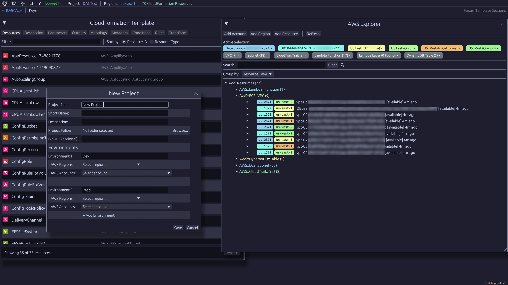

#  AWS Dash

**AI-powered AWS environment exploration and operations**
<div align="right">
Powered by <a href="https://github.com/fibanez/stood">Stood Agent Library</a> 
</div>
<br clear="left">
&nbsp;<br>
AWS Dash provides AI-assisted AWS environment exploration and operations through an intuitive desktop interface. Explore resources across multiple AWS accounts and regions, and leverage AI agents powered by the Stood library to perform intelligent operations for different domains, including infrastructure, security, system administration.
&nbsp;<br>

# 
> ⚠️ **Alpha Release**: AWS Dash is currently in active development. Features and APIs may change as we work toward the first stable release.

&nbsp;<br>
## 📚 Documentation

- **[User Guide](docs/userguide/)**: Incomplete user documentation
- **[Technical Documentation](docs/technical/)**: Architecture and development guides

<br clear="left">

## 🚀 Quick Start

### Installation

**This is a Rust project requiring Rust 1.81 or later.**

#### Install Rust (if not already installed)
- **All platforms**: Visit [rustup.rs](https://rustup.rs/) and follow the installation instructions
- **Linux/macOS**: `curl --proto '=https' --tlsv1.2 -sSf https://sh.rustup.rs | sh`
- **Windows**: Download and run [rustup-init.exe](https://win.rustup.rs/), install Build Tools for Visual Studio with C++ option, cmake, and NASM

#### Build from source
```bash
git clone https://github.com/aws/aws-dash-architect.git
cd aws-dash-architect
cargo build --release
```

#### Run the application
- **Linux/macOS**: `./target/release/awsdash`
- **Windows**: `.\target\release\awsdash.exe`

### Prerequisites

⚠️ **AWS Identity Center is Required**: AWS Dash requires AWS Identity Center (formerly AWS SSO) configured before first use.

### Setup

1. **[Setup IAM Identity Center](docs/userguide/setup-iam-identity-center.md)** - Configure AWS Identity Center with required permissions

## ✨ Key Features

### 🤖 AI-Powered Operations with Agent Framework

Intelligent AWS infrastructure operations powered by AI agents:

- **Natural Language Operations**: Describe what you want to do in plain English
- **Multi-Step Task Execution**: AI agents can perform complex, multi-step AWS operations
- **Context-Aware Assistance**: Agents understand your AWS environment and provide relevant guidance
- **Task Planning**: Automatic breakdown of complex operations into manageable steps

> **Powered by Stood**: The Agent Framework uses the [Stood Agent Library](https://github.com/fibanez/stood) to provide sophisticated AI agent capabilities with tool use, task planning, and intelligent decision-making.

### 🌐 Cross-Account and Cross-Region Seamless AWS Explorer 

Unified resource discovery and visualization:

- **Multi-Account and Multi-Region Visibility**: See all your AWS resources across accounts and regions in one interface
- **Intelligent Resource Discovery**: Find and explore resources with advanced filtering and search
- **Real-Time Data**: Direct AWS API integration with efficient caching
- **Resource Details**: View comprehensive resource properties and configurations
- Support for 93 services and almost 200 resource types

## 🎯 Who Should Use AWS Dash?

### Primary Users
- **DevOps Engineers** managing multi-account and multi-region AWS environments
- Developers working on complex AWS deployments
- **Cloud Engineers** performing infrastructure operations
- **Site Reliability Engineers** troubleshooting and analyzing AWS resources
- **AWS Administrators** exploring and managing resources across accounts

### Use Cases
- **Resource Discovery**: Find and analyze resources across multiple AWS accounts and regions
- **Infrastructure Operations**: Use AI assistance for complex AWS operations
- **Multi-Account Management**: Manage resources spanning multiple AWS accounts from one interface
- **Resource Analysis**: Deep dive into resource configurations and relationships
- **Operational Tasks**: Automate repetitive AWS operations with AI-powered assistance

## 📄 License

AWS Dash is licensed under the [Apache License 2.0](LICENSE).

---

**Explore AWS resources intelligently. Operate with AI assistance. Manage multi-account environments effortlessly.**

*AWS Dash - AI-powered AWS resource exploration and operations.*
